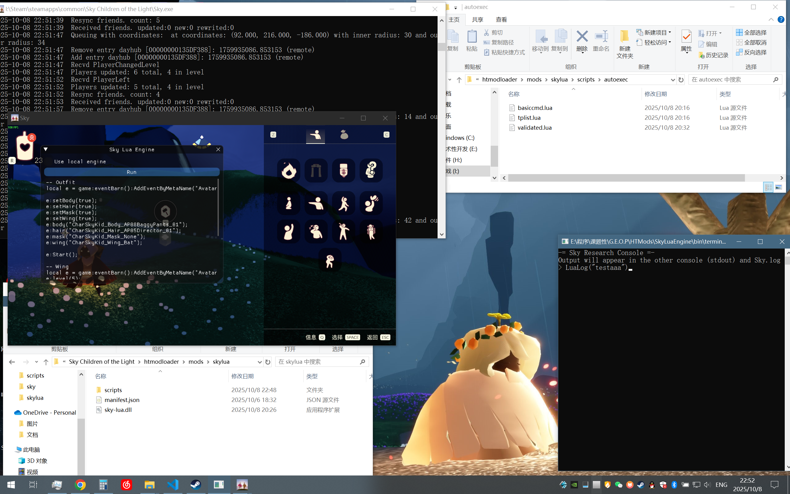

# Sky: COTL Research Tool

A really simple C program that lets you load Lua scripts into "Sky: Children of the Light" (desktop version) through a named pipe while it's running. The scripts run in the game's built-in Lua engine.



The provided `terminal.c` lets you script in a command line (like a REPL) to load scripts into the game, while `hotload.c` lets you load scripts from a directory.

The mod itself is comprised of `debug.c` (a DLL file that is loaded into the game to listen for incoming scripts) and `launch.c` (for launching the game and injecting debug.dll into it).

Because of a weird behavior in Sky, you have to run the DLL injection immediately when the game launches and before the game engine initializes, otherwise you won't see the game output in the terminal. That's why `launch.c` both launches the game and injects the DLL into the process. You have to pass the name of the executable and the DLL (the executable is Sky.exe, the DLL is debug.c). You can create a launch script called `play.bat` like this:

```
@echo off
bin\launch.exe bin\debug.dll "C:\Program Files (x86)\Steam\steamapps\common\Sky Children of the Light\Sky.exe"
bin\terminal.exe
```

This launches the game and opens terminal.exe (example compilation of [terminal.c](terminal.c)) automatically. (Note: in this example, terminal.exe keeps the named pipe open, so hotload.exe won't work at the same time.)

I've only tested this on Linux with wine, and haven't actually tested it on Windows, so I don't know if it works on native Windows. It works on my system at the time of writing this README file, and it has continued to work through multiple updates, so it will probably continue to work.

## Updating

If it breaks, two patterns in `debug.c` need to be updated. `debugdostring` is the debug function built into the game that loads code from a Lua source string. `update` is nonspecific, it's just a function that runs in the game's main loop and receives a Lua state pointer - it can be replaced with any other similar function (the criteria being that it gets a Lua state and runs in the game's main update thread).

The main update thread thing is important because Lua is single-threaded, so `debugdostring` has to be called from within the game's main thread. If you tried calling it directly, it would cause occasional crashes.
